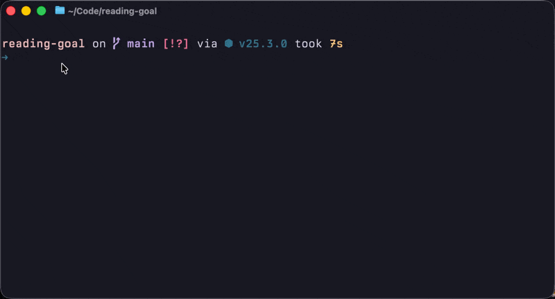

# portsweep

A terminal UI for managing processes listening on ports. Quickly see what's running, select processes, and kill them with a single keystroke.



## Features

- **Interactive TUI** - Navigate with keyboard, select multiple processes, kill in batch
- **Smart command formatting** - Transforms cryptic paths like `/Users/you/Code/project/node_modules/.pnpm/@cloudflare+workerd@1.2.3/...` into readable names like `workerd (project)`
- **Auto-refresh** - Process list updates every 2 seconds
- **Filter system ports** - Toggle visibility of privileged ports (<1024)
- **Full command preview** - See the complete command for the focused process

## Installation

### Homebrew (macOS)

```bash
brew install jillesme/tap/portsweep
```

### Go install

```bash
go install github.com/jillesme/portsweep@latest
```

### Download binary

Download the latest release from the [releases page](https://github.com/jillesme/portsweep/releases).

## Usage

```bash
portsweep
```

### Keybindings

| Key | Action |
|-----|--------|
| `↑` / `k` | Move up |
| `↓` / `j` | Move down |
| `space` / `tab` | Select/deselect process |
| `a` | Select all |
| `enter` / `d` | Kill selected process(es) |
| `r` | Refresh |
| `s` | Toggle system ports (<1024) |
| `q` | Quit |

### Flags

```bash
portsweep --help     # Show help
portsweep --version  # Show version
```

## Smart Command Formatting

portsweep automatically formats long command paths into readable names:

| Raw Command | Displayed As |
|------------|--------------|
| `node /Users/you/Code/my-api/node_modules/.pnpm/@cloudflare+workerd@1.2.3/...` | `workerd (my-api)` |
| `node /path/to/project/node_modules/.bin/vite` | `vite (project)` |
| `/opt/homebrew/Cellar/opencode/1.0.0/bin/opencode` | `opencode` |
| `/Applications/Spotify.app/Contents/MacOS/Spotify` | `Spotify` |
| `/usr/libexec/rapportd` | `rapportd` |

The full command is always visible below the process list when focused.

### Supported Formatters

- **npm/pnpm/yarn** - Extracts package names from `node_modules`
- **Homebrew** - Shows package name from Cellar paths
- **macOS apps** - Extracts app name from `.app` bundles
- **Project directories** - Detects common project folders (`Code/`, `Projects/`, etc.)
- **System binaries** - Simplifies `/usr/bin/`, `/usr/libexec/` paths

## Requirements

- macOS (uses `lsof` for port detection)
- Linux support is possible but not officially tested yet

## Contributing

Contributions are welcome! The command formatter system is designed to be extensible - implement the `CommandFormatter` interface to add support for new command patterns.

```go
type CommandFormatter interface {
    Name() string
    CanFormat(cmd string) bool
    Format(cmd string) string
}
```

## License

MIT - see [LICENSE](LICENSE)
